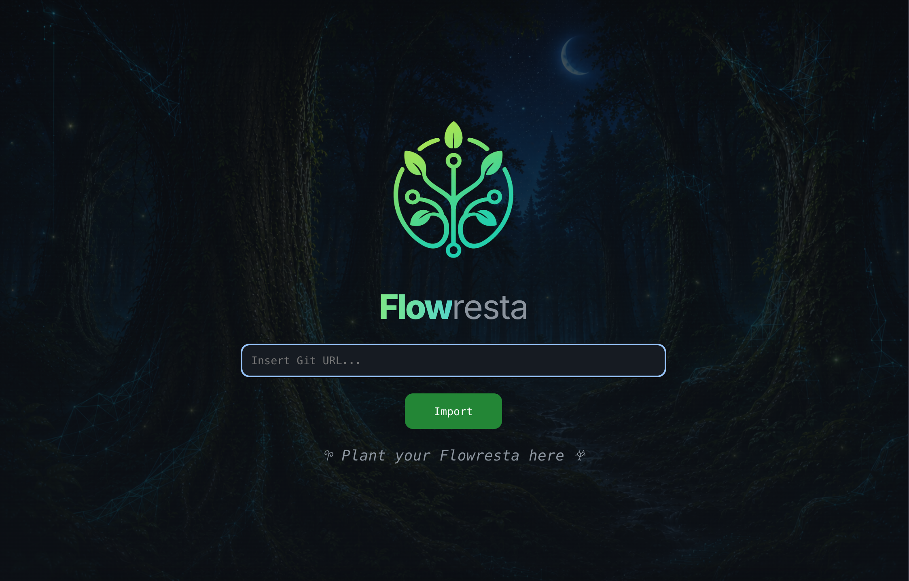
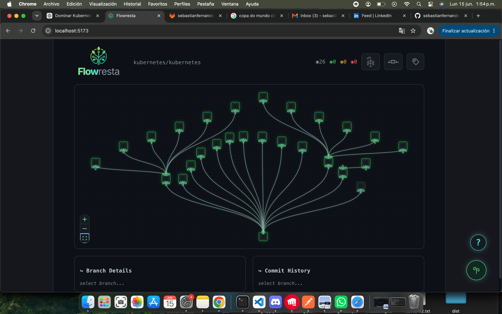
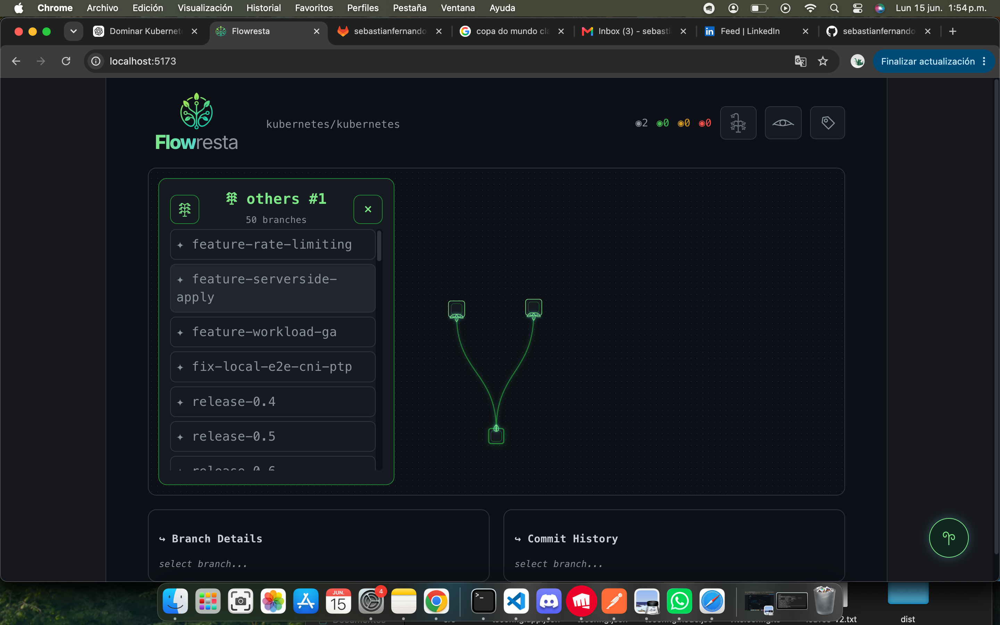
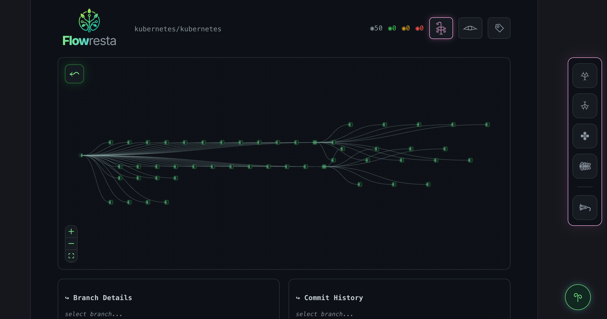
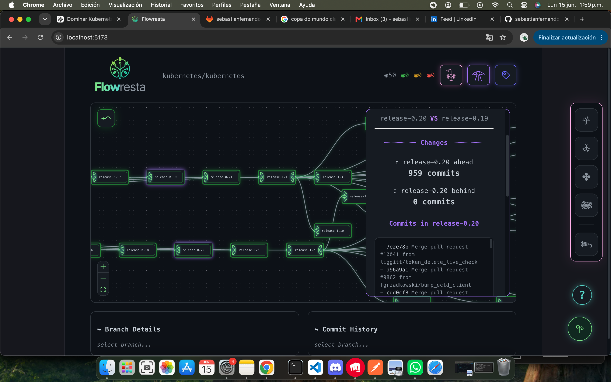
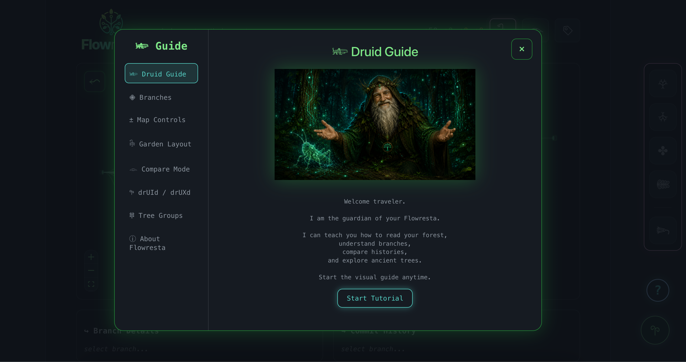

<p align="center">
  
</p>

<h1 align="center">
𖣂 Flowresta
</h1>

<p align="center">
Transform your Git repositories into living forests 🌳
</p>


---

## 𓆧 What is Flowresta?

Flowresta is an experimental Git visualization tool that transforms repositories into interactive living forests.

Branches become trees.  
Commits become growth rings.  
History becomes life.

Instead of reading a repository as a list,
Flowresta lets you explore software evolution visually.


---

## ✨ Features


### 𖣂 Living Git Forest

Visualize repository branches as organic structures:

- 🌱 branches as living nodes
- 🌿 relationships between branches
- 🍃 repository growth visualization
- 🌳 ancient repository support


---

### 𖠻 Ancient Tree Mode

Large repositories are automatically organized into Tree Groups.

Designed for repositories with many branches:

- automatic grouping
- expandable tree dimensions
- cleaner exploration


---

### 𓁹 Compare Mode

Compare branches visually:

- commits ahead
- commits behind
- changed files
- merge insights


---

### 𓆧 drUId / drUXd Assistant

Flowresta includes a forest guide:

- onboarding tutorials
- repository insights
- contextual suggestions
- ancient tree guidance


---

### 𓇗 Garden Layouts

Change how your repository grows:

𖣂 Crown Tree  
𖣂 Root Tree  
✤ Clover  
𖠺 Paripinnate


---

## 🖼 Preview









---

## 🚀 Run locally


Clone:

```bash
git clone https://github.com/YOUR_USER/flowresta.git
```


Install:

```bash
npm install
```


Start:

```bash
npm run dev
```


Build:

```bash
npm run build
```


Preview production:

```bash
npm run preview
```


---

## 🛠 Tech Stack

- React
- TypeScript
- Vite
- React Flow
- GitHub API


---

## 🌱 Philosophy

Codebases are not static.

They grow.  
They branch.  
They evolve.

Flowresta tries to reconnect software engineering with nature.


---

## 👤 Creator

Created by:

Sebastian Martinez

🌎 Chile / Brazil


---

## 📜 License

MIT License


---

<p align="center">
𖣂 Plant your Flowresta
</p>
